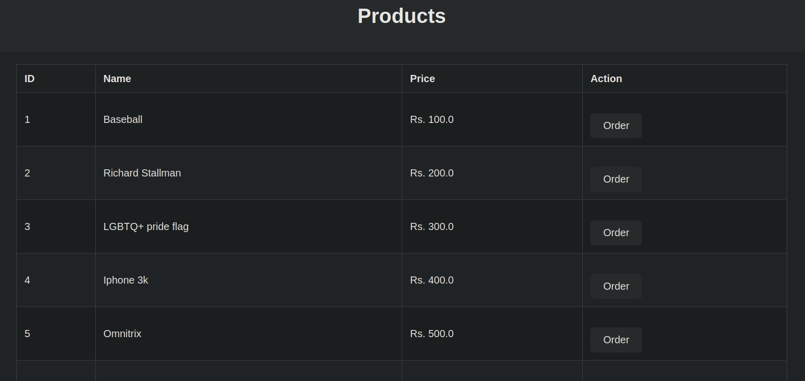
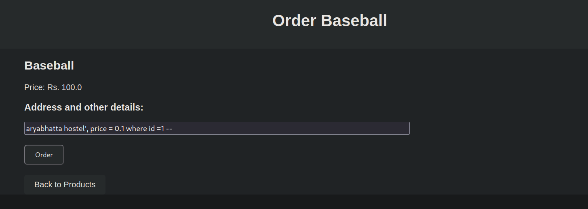
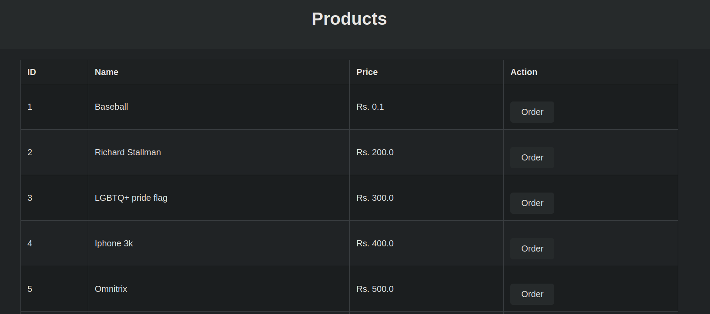

# Project 2

My project is a simple shopping site with some items whose details can be modified using a sql injection attack to lower its price.

The application is written in python using flask and is containerized using docker.

After running the docker image , open a web browser and go to 

`http://127.0.0.1:5000` to enter the site.

When placing the order , use 

`aryabhatta hostel', price = 0.1 where id =1 --` in the address column and the price for the product will be changed to 0.1 , id being the product id .

After executing the query,

Resulting product list is 

This vulnerability could be further exploited to cause more havoc on the site.
