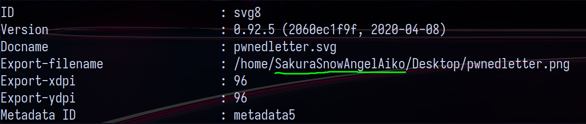

`    Task 2 

Username : SakuraSnowAngelAiko

    Task 3

Sherlock gave the link to a github account by the user

After much searching through the different repos , I found a pgp key file of the user.

Analyzing the file with gnupg , the email id of the user was displayed.

The id is SakuraSnowAngel83@protonmail.com
For the original name of the user, I spent much time with the github account but could not find out about it. So I decided to go for online tools and through OSINT framework I came across the site Google Social Search .

Akio Abe is the real name of the user.

    Task 4

The ethminer repository shows that the user was using Ethereum wallet .

I cloned the ethminer repo but it gave no clue about the cyptowallet address , so I decided to look in other repositories of the user. Finally my eye caught the older commits on ETH repo.

Turns out the user by mistakenly put his cryptowallet address in the miningscript file , but changed it later onwards.
The cryptowallet addresss is : 0xa102397dbeeBeFD8cD2F73A89122fCdB53abB6ef

Also the link provided is for ethermine.org which is an ethereum mining pool which leads us to the next answer : Ethermine

For the last part , I searched for ways to use the email id of user and password as pswd@eu1 as given in image to log into different crypto wallets. But it was of no use.
Finally I decided to use the wallet address to get something . After reading some stack-overflow threads I stumbled upon etherscan which allows to scan for wallet transactions .
The transactions provided the other cryptocurrency used with the wallet.

Tether was the other crypto used.

    Task 5

Using the image and the google social search, I was able to reach the user's current twitter handle.

The current twitter handle is : SakuraLoverAkio

Deepaste is a darkweb uncensored pastebin. Given string is md5sum to search for the paste.

The url is the answer : http://deepv2w7p33xa4pwxzwi2ps4j62gfxpyp44ezjbmpttxz3owlsp4ljid.onion

SSID is still incomplete.

    Task 6

Using the image posted on twitter by Aiko , one of the photo is of cherry blossoms in a straight line , using google lens I was able to find the location of the photo and also the nearest airport to it.

The answer is DCA Airport.

The answer for the next part is HND Airport.
After searching through maps of japan , I identified the last map as niigata , Sado islands and fukushima. I first though that the lake was in niigata and tried finding all the lakes there but nothing matched. As the final lake was in fukushima and not niigata.

Lake Inawashiro is the answer.

On the deepaste site , location of the place is given with free wifi.

Answer is hirosaki.