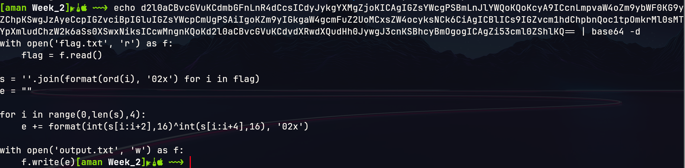

# Challenge 1

The given source.enc file contained base64 encoded text which I converted to ascii gave a python program with its output stored in the output.txt in the github repo.

I first modified the given program to find how is it working and how to modify it to convert a given string to encoded and then from encoded to given string. I used simple froxhex and format functions to get the flag after discovering that if i xor the 2 bytes with 4 bytes starting from 0 to length of flag , I will recieve the 4 correct bytes.

[Challenge_1.py](Scripts/Challenge_1.py)

Flag : CSOC23{345y_ba5364_4nd_x0r?}

# Challenge 2

This challenge was a bit easy , only the number systems in which the ascii values of the characters were encoded needed to be identified.

[Challenge_2.py](Scripts/Challenge_2.py)

Flag : CSOC23{ju57_d1ff3r3n7_3nc0d1n65_l0l}
