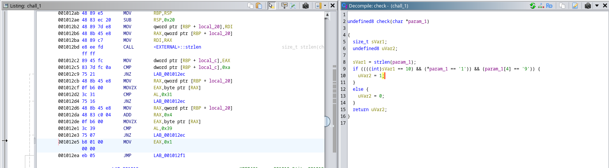

# Chall 1

Given file was a 64 bit lsb executable as output of file command, so first I used chmod +x to give it executable permission. Then I switched to ghidra to reverse engineer it .

The check function used in the program just checks the size of string and first and fifth characters. So any string like : `1___9_____` would be a suitable password.

# Chall 2

 
